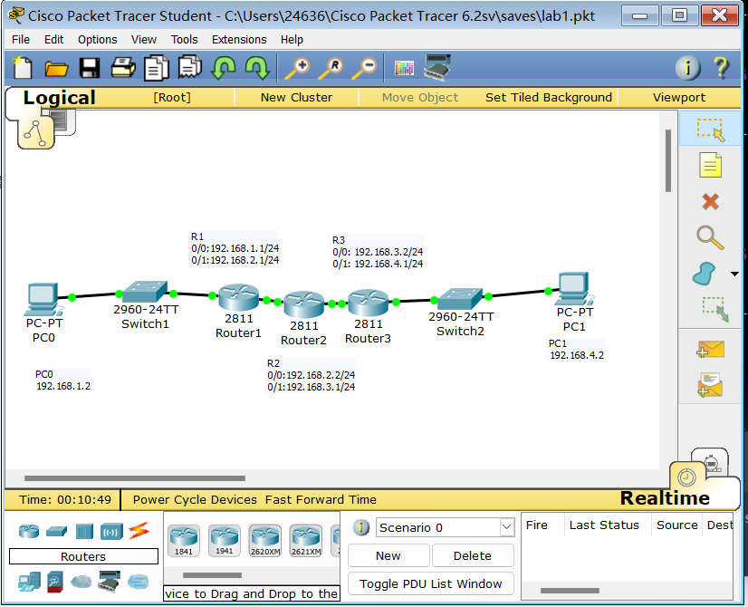
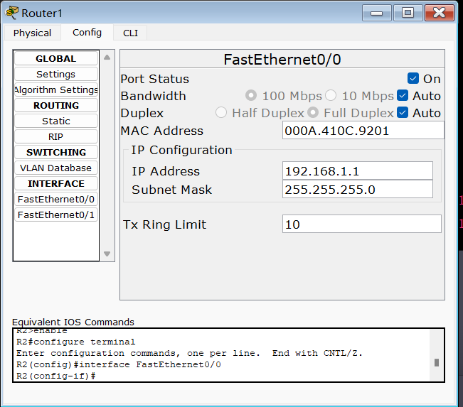
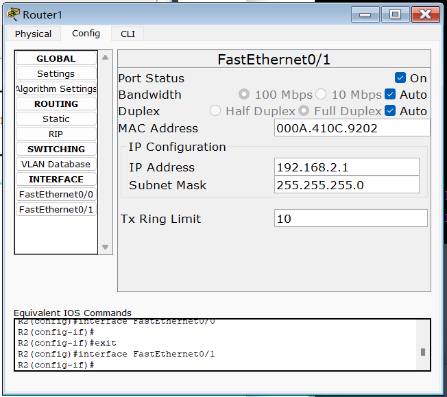
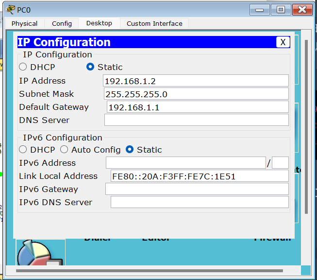
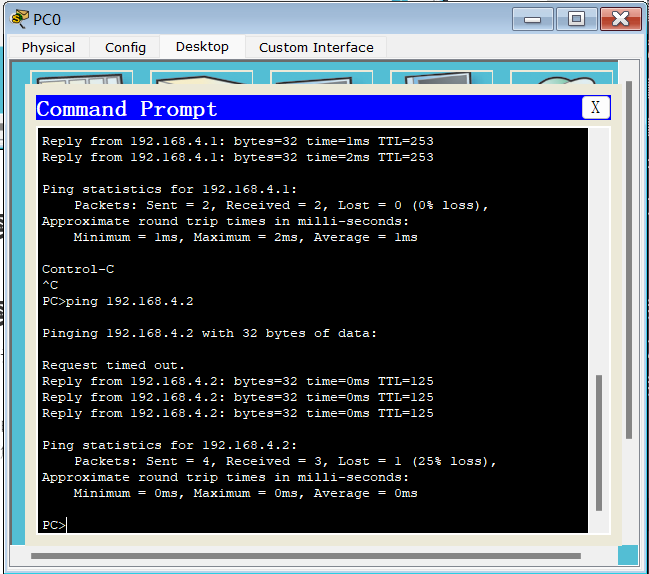
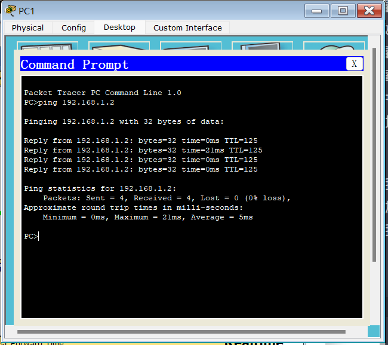

<center>北京师范大学</center>
<center>2022-2023学年春季学期  “网络实验”实验报告</center>
<center><b><font size=6 bold=true>实验01：静态路由配置实验</font><b></center>


| 姓    名 |   学    号   | 学    院 | 日    期  |
| :------: | :----------: | :------: | :-------: |
|  段欣然  | 202011081033 | 人工智能 | 2023.2.22 |

<hr>
**1.实验目的**：

本次实验的主要目的是了解静态路由的配置和实现原理，熟悉路由器的基本操作，掌握在网络中进行静态路由配置的方法和技巧。

**2.实验内容**：

1. 搭建网络拓扑，包括三台路由器和两台PC。
2. 配置路由器的IP地址和路由表信息，实现路由器之间的通信。
3. 配置PC的IP地址和默认网关信息，实现PC和路由器之间的通信。

$\boxtimes$ 基础性实验  $\square$  综合性实验  $\square$ 设计性实验

<hr>													
<center><b><font size=6>实验报告正文</font></b></center>


# 实验过程

## 搭建网络拓扑

首先需要搭建网络拓扑，如图所示，其中R1、R2、R3为三台路由器，PC0和PC1为两台PC。



## 配置路由器

为了使路由器之间能够相互通信，需要对路由器进行配置。以R1为例，配置IP地址和路由表信息：





```
R1(config)#ip route 192.168.3.0 255.255.255.0 192.168.2.2
R1(config)#ip route 192.168.4.0 255.255.255.0 192.168.3.2
```

同样的方法对R2和R3进行配置。

## 配置PC

为了使PC和路由器之间能够相互通信，需要对PC进行配置。以PC0为例，配置IP地址和默认网关信息：

```
IP address: 192.168.1.2
Subnet mask: 255.255.255.0
Default gateway: 192.168.1.1
```



同样的方法对PC1进行配置：

```
IP address: 192.168.1.2
Subnet mask: 255.255.255.0
Default gateway: 192.168.1.1
```


# 实验结果

PC0 ping PC1



PC1 ping PC0



实验成功完成，两台PC可以互相通信。

# 实验反思

1. 静态路由配置过程中，需要注意网络地址的设置以及下一跳地址的正确配置，否则可能会导致网络不通。
2. 静态路由配置相对于动态路由来说较为繁琐，需要手动设置路由表，但相应地也更加稳定可靠。
3. 通过本次实验，我深刻理解了静态路由配置的原理和实现方法，并对计算机网络的相关知识有了更加深入的认识。同时，实验过程中还锻炼了我的问题解决能力和实践操作能力，对我的专业学习和未来工作都具有积极意义。
