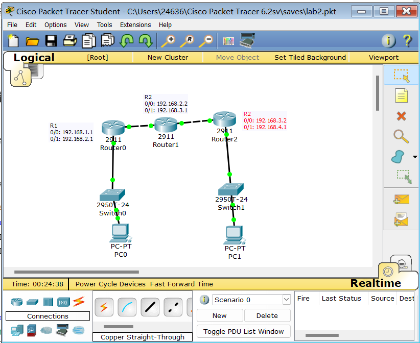
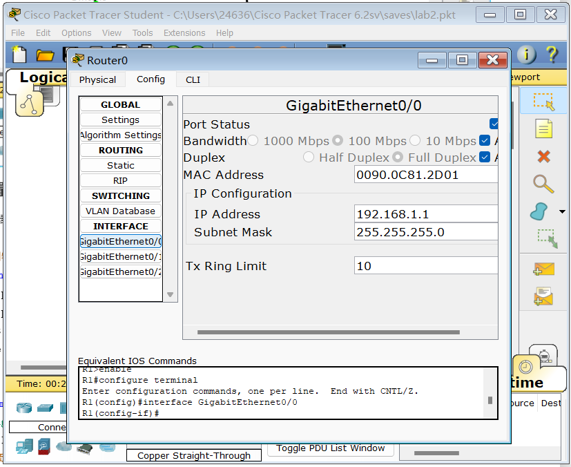
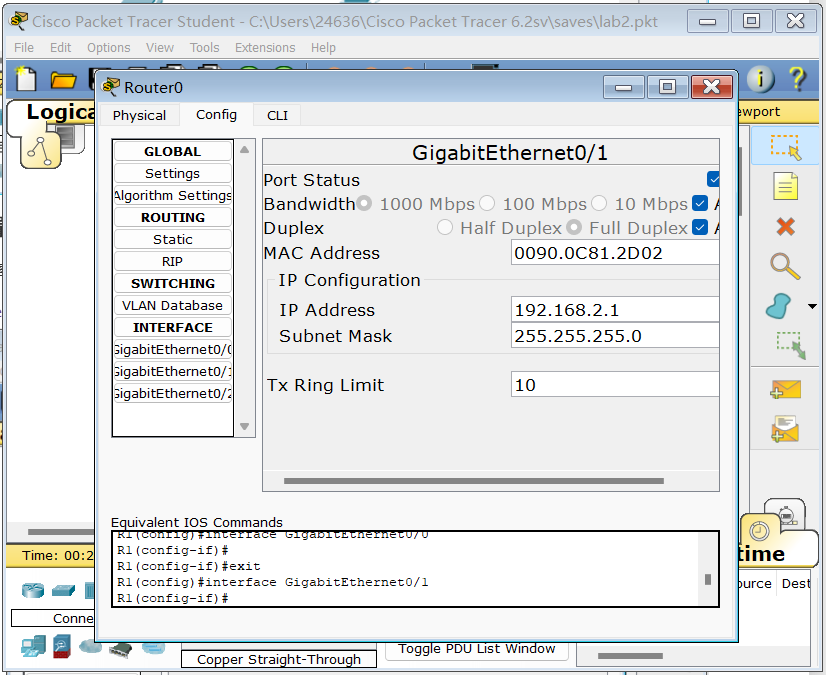
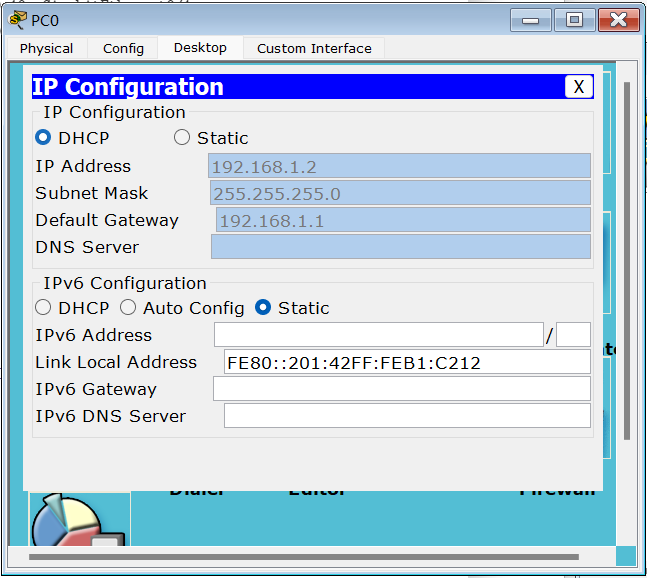
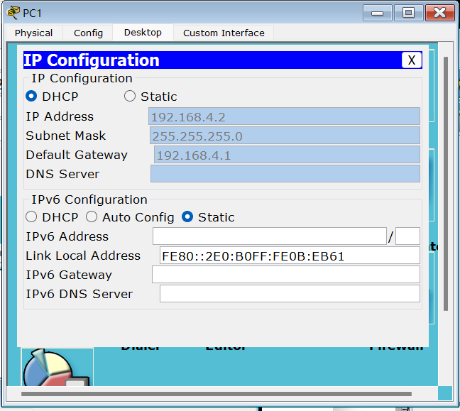
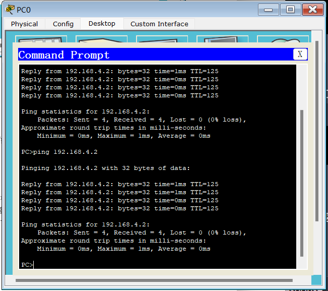
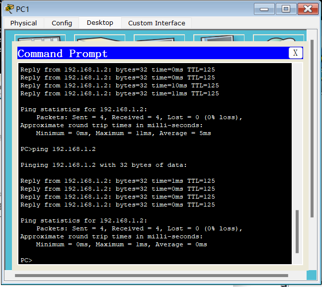

<center>北京师范大学</center>
<center>2022-2023学年春季学期  “网络实验”实验报告</center>
<center><b><font size=6 bold=true>实验02：RIP配置</font><b></center>


| 姓    名 |   学    号   | 学    院 |  日    期  |
| :------: | :----------: | :------: | :--------: |
|  段欣然  | 202011081033 | 人工智能 | 2023.03.01 |

<hr>

**1.实验目的**：

1. 了解路由选择协议（Routing Protocol）的基本原理及分类；
2. 掌握RIP协议的基本原理；
3. 实现RIP协议；
4. 掌握路由器配置及路由表查看的基本命令。

**2.实验内容**：

1. 建立拓扑结构；
2. 配置路由器IP地址；
3. 配置路由器RIP协议；
4. 查看路由表信息；
5. 模拟故障情况并查看路由表变化。


$\boxtimes$ 基础性实验  $\square$  综合性实验  $\square$ 设计性实验

<hr>													
<center><b><font size=6>实验报告正文</font></b></center>
# 实验过程

## 设置网络拓扑结构


根据实验要求，建立3台路由器和2台终端的拓扑结构，如下图所示：



## 配置路由器IP地址：

在每个路由器上配置IP地址，以R1为例，配置如下：





同理，配置R2和R3的IP地址。

## 配置路由器RIP协议：

在每个路由器上开启RIP协议，并配置相应的网络地址，以R1为例，配置如下：

```
R1(config)#router rip
R1(config-router)#net 192.168.1.0
R1(config-router)#net 192.168.2.0
```

同理，配置R2和R3的RIP协议。

## 查看路由表信息：

在每个路由器上查看路由表信息，以R1为例，查看命令如下：

```
R1#sh ip route
Codes: L - local, C - connected, S - static, R - RIP, M - mobile, B - BGP
       D - EIGRP, EX - EIGRP external, O - OSPF, IA - OSPF inter area
       N1 - OSPF NSSA external type 1, N2 - OSPF NSSA external type 2
       E1 - OSPF external type 1, E2 - OSPF external type 2, E - EGP
       i - IS-IS, L1 - IS-IS level-1, L2 - IS-IS level-2, ia - IS-IS inter area
       * - candidate default, U - per-user static route, o - ODR
       P - periodic downloaded static route

Gateway of last resort is not set

     192.168.1.0/24 is variably subnetted, 2 subnets, 2 masks
C       192.168.1.0/24 is directly connected, GigabitEthernet0/0
L       192.168.1.1/32 is directly connected, GigabitEthernet0/0
     192.168.2.0/24 is variably subnetted, 2 subnets, 2 masks
C       192.168.2.0/24 is directly connected, GigabitEthernet0/1
L       192.168.2.1/32 is directly connected, GigabitEthernet0/1
R    192.168.3.0/24 [120/1] via 192.168.2.2, 00:00:10, GigabitEthernet0/1
R    192.168.4.0/24 [120/2] via 192.168.2.2, 00:00:10, GigabitEthernet0/1
```

## 配置DHCP

以R1和PC0为例，配置如下：

```
R1(config)#ip dhcp pool MyPool
R1(dhcp-config)#default-router 192.168.1.1
R1(dhcp-config)#network 192.168.1.0 255.255.255.0
```



同理配置R3和PC1.



## 实验结果





经过以上步骤，我们成功地实现了RIP协议，并查看了路由表信息和路由表变化。在模拟故障情况时，我们发现路由器能够自动更新路由表信息，保证了网络的正常通信。

## 实验反思

通过本次实验，我们深入了解了路由选择协议（Routing Protocol）的基本原理及分类，并掌握了RIP协议的基本原理。我们在实现RIP协议时，深入理解了网络拓扑结构及路由器的配置，加深了对网络基础的理解。通过模拟故障情况，我们体验到了路由器自动更新路由表信息的作用，深化了对网络故障排除的认识。
