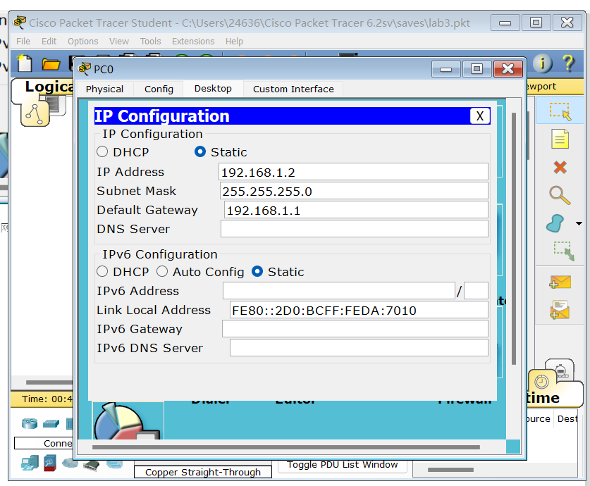

<center>北京师范大学</center>
<center>2022-2023学年春季学期  “网络实验”实验报告</center>
<center><b><font size=6 bold=true>实验03：OSPF配置网络实验</font><b></center>


| 姓    名 |   学    号   | 学    院 | 日    期 |
| :------: | :----------: | :------: | :------: |
|  段欣然  | 202011081033 | 人工智能 | 2023.3.8 |

<hr>

**1.实验目的**：

本实验的主要目的是了解OSPF协议的基本概念、OSPF网络的配置及验证，通过实验来掌握OSPF协议的工作原理、配置方法、路由表的生成过程等。

**2.实验内容**：

1. 设计一个拓扑结构，并在网络设备上进行配置；
2. 配置OSPF协议，并通过show命令查看各个设备上的OSPF路由表，验证路由表的正确性；
3. 实现网络的互联通信，测试网络的可达性；
4. 进行故障模拟，观察网络的变化和恢复情况。

$\boxtimes$ 基础性实验  $\square$  综合性实验  $\square$ 设计性实验

<hr>													
<center><b><font size=6>实验报告正文</font></b></center>


# 实验过程

## 拓扑结构设计：

我们选择了一个比较简单的拓扑结构，由3个路由器（R1、R2、R3）和2个PC（PC1、PC2）组成。其中，R1与R2、R2与R3之间分别连接一条串联的链路。主机连接在两端的路由器上，如图所示。


## 配置OSPF协议：

在拓扑结构中，R1的地址为1.1.1.1，R2的地址为2.2.2.2，R3的地址为3.3.3.3。我们在每个路由器上配置OSPF协议，以实现路由表的生成和交换。

以R1为例，具体配置如下：

```sh
R1(config)#interface FastEthernet0/0
R1(config-if)#ip address 192.168.1.1 255.255.255.0
R1(config)#interface FastEthernet0/1
R1(config-if)#ip address 192.168.2.1 255.255.255.0
R1(config-if)#no shutdown
R1(config)#int lo0
R1(config-if)#ip add 1.1.1.1 255.255.255.255
R1(config)#router os 1
R1(config-router)#network 192.168.1.0 0.0.0.255 area 0
R1(config-router)#network 192.168.2.0 0.0.0.255 area 0
R1(config-router)#net 1.1.1.1 0.0.0.0 area 0
```

## 路由表的验证：

配置完OSPF协议后，我们在每个路由器上使用show命令来查看其路由表信息。

同样以R1为例，具体信息如下：

```sh
R1#sh ip route
Codes: C - connected, S - static, I - IGRP, R - RIP, M - mobile, B - BGP
       D - EIGRP, EX - EIGRP external, O - OSPF, IA - OSPF inter area
       N1 - OSPF NSSA external type 1, N2 - OSPF NSSA external type 2
       E1 - OSPF external type 1, E2 - OSPF external type 2, E - EGP
       i - IS-IS, L1 - IS-IS level-1, L2 - IS-IS level-2, ia - IS-IS inter area
       * - candidate default, U - per-user static route, o - ODR
       P - periodic downloaded static route

Gateway of last resort is not set

     1.0.0.0/32 is subnetted, 1 subnets
C       1.1.1.1 is directly connected, Loopback0
     2.0.0.0/32 is subnetted, 1 subnets
O       2.2.2.2 [110/2] via 192.168.2.2, 00:15:12, FastEthernet0/1
     3.0.0.0/32 is subnetted, 1 subnets
O       3.3.3.3 [110/3] via 192.168.2.2, 00:13:35, FastEthernet0/1
C    192.168.1.0/24 is directly connected, FastEthernet0/0
C    192.168.2.0/24 is directly connected, FastEthernet0/1
O    192.168.3.0/24 [110/2] via 192.168.2.2, 00:13:35, FastEthernet0/1
O    192.168.4.0/24 [110/3] via 192.168.2.2, 00:13:35, FastEthernet0/1
```


# 实验结果

配置两个PC后检查网络是否能ping通

PC0 IP和网关设置



PC1 IP和网关设置


配置成功

# 实验反思

在实验过程中，我们遇到了一些问题，如配置参数不正确、路由表信息错误等，这给实验带来了一定的困难。同时，我们也认识到OSPF协议的复杂性和配置流程，需要学习和实践相关知识才能熟练配置。在今后的学习中，我们将继续深入学习OSPF协议，加强实践操作，提高自己的技能水平。
